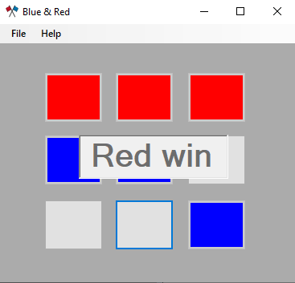

# Blue_and_Red

<b style="font-size: xx-large; font-family: Arial, Helvetica, sans-serif;">
blue and red game (XO)
</b>

This game is similar to XO game with blue and red box

If blue player win, this text is show

If red player win, this text is show

If both players are equal, this text will be displayed

